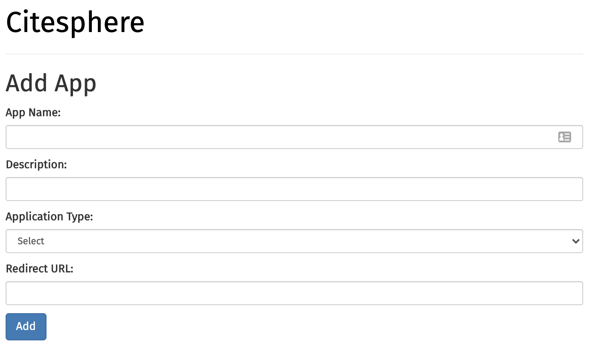
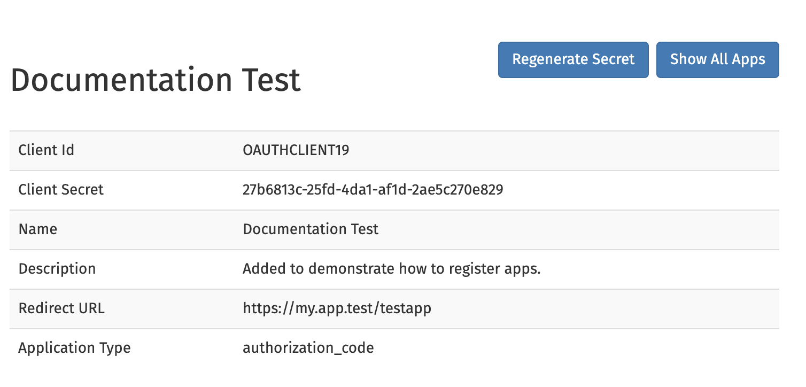

OAuth2 Documentation
====================

.. autosummary::
   :toctree: generated

Citesphere provides OAuth2 for handling authentication and authorization. You can use any form of OAuth2 Client to get a token.

If you are developing an application and would like to use Citesphere to authenticate your users, please refer to  ``Using Citesphere to Authenticate Users for Single Sign-On.``

Creating an App
---------------

Any application that would like to use Citesphere for authentication and authorization first needs to be registered with Citesphere.

1. Login to Citesphere as admin.

2. Go to Apps and add a new app.

3. You should see a form like this:

4. Provide the requested information:

   * App Name: a descriptive name of the app to be registered (e.g. the name of the app such as “Vogon”).

   * Description: a short description of the apps (does not have to be longer than a sentence).

   * Application Type:

      * Apps need user information (Authorization Code): for any app that needs to authenticate specific users (e.g. if you want to use 
      Citesphere for user authentication).

      * Apps do not need user information (Client Credentials): for any app that do not want to log in users but need a way to talk to Citesphere.

   * Redirect URL: a url to redirect to after Citesphere has processed a users authentication.

5. Click “Add”

6. You should see something like this:

Make sure to copy the client secret and keep it in a safe place. Once you navigate away from this page, there is no way to retrieve 
this information.

Regenerating Client Secrets
---------------------------
If for some reason you loose a client secret or you want to revoke access to the app using the current client id and 
secret, you can regenerate a client secret. To do this navigate to the page of the app in Citesphere and click “Regenerate Secret.” A new 
secret will be created and shown.

   *Note* that once you have regenerated a secret, any app that uses the old secret will not be able to use 
   Citesphere’s API (including OAuth) any longer.